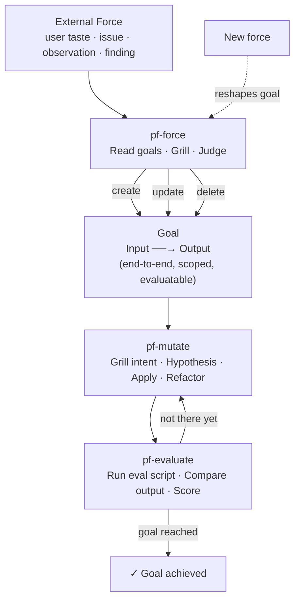

# Skills

A collection of agent skills for software engineering and personal productivity.

---

## Installation

Clone this repo to `~/.claude/skills`, then run the install script:

```bash
git clone git@github.com:Jaeyong-Cho/skills.git ~/.claude/skills
~/.claude/skills/install.sh
```

The script detects which AI agents are installed and sets up each one:

| Agent | What gets configured |
|-------|----------------------|
| Claude Code | `~/.claude/CLAUDE.md` symlink + `PFJ_PATH` in `settings.json` and shell rc |
| GitHub Copilot CLI | `~/.copilot/copilot-instructions.md` symlink + `PFJ_PATH` in shell rc |

`PFJ_PATH` is exported in `.zshrc`/`.bashrc` and points to your journal directory (default: `~/pofe`).

---

## Global Instructions

`CLAUDE.md` defines global behaviors active in every session:

- **Caveman style** — terse, no filler, fragments ok, technical terms exact
- **Session logging** — after any skill session, append a timestamped summary + lessons to `$PFJ_PATH/today.md`

---

## PF — Architecture Workflow

PF applies the VAO (Value–Aspect–Object) three-layer design philosophy: **Value** (why — user goals), **Aspect** (how — composable algorithms), **Object** (what — stable domain objects).

### Skills

| Skill | When to use |
|-------|-------------|
| `pf` | Design clear — grill-me session, write and confirm an ADR |
| `pf-impl` | ADR confirmed — TDD implementation, RED → GREEN → REFACTOR |
| `pf-grill-impl` | Design + implement in one session — no ADR written |
| `pf-observe` | Build observation scripts to surface differences, patterns, and causes in a running system |
| `pf-readme` | Write or update per-directory README.md files via grill-me |

---

## Evolutionary Software

Software evolves. External forces — user taste, detected issues, observations, new findings — create pressure on what the software should do. That pressure shapes goals. Goals are end-to-end targets: given a concrete input, the system should produce a specific output.

A goal is rarely reached in one step. You mutate the software toward the goal, evaluate the result against the real input/output, and iterate until it converges.



### Philosophy

- **Force** — every change originates from an external pressure, not an internal impulse. If there's no force, there's no goal.
- **Goal** — always end-to-end. Not "improve the internals" but "given this input, produce this output."
- **Mutation** — one focused change at a time. Hill-climbing, not redesign.
- **Evaluation** — run the real system with the real input. No mocks, no internal checks.
- **Iteration** — a goal may take many mutations to reach. Each mutation is evaluated and either kept or discarded.

### Skills

| Skill | When to use |
|-------|-------------|
| `pf-force` | A force arrives — apply it to the goal landscape (create, update, or delete goals) |
| `pf-mutate` | Mutate the software one step toward a goal |
| `pf-evaluate` | Run the eval script end-to-end; score functional, performance, and taste |

### Artifacts

```
evolve/
└── <id>-<slug>/          # e.g. 01-response-quality
    ├── goal.md           # Input, Expected output, History
    ├── eval/             # eval command (single CLI entry point, any internal structure)
    ├── N_mutation.md     # hypothesis · change · how to evaluate · status
    └── N_evaluation.md   # actual output · functional · taste · verdict
```

---

## Other Skills

| Skill | What it does |
|-------|-------------|
| `grill-me` | Interview relentlessly about any plan or design until shared understanding is reached |
| `caveman` | Ultra-compressed output mode — ~75% fewer tokens, no filler |
| `write-a-skill` | Create or review agent skills with proper structure and checklist |
