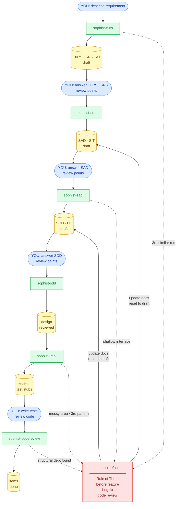

# SOPHIST Skills — Workflow Guide

SOPHIST is a V-model documentation system for software projects. The skills listed here guide you through the full pipeline from capturing customer intent to verified implementation.

---

## The V-Model Pipeline

```
CuRS (What customers want)
  └─► SRS (Testable requirements)       [sophist-srs reviews & cascades]
        └─► SAD (Architecture)           [sophist-sad reviews & cascades]
              └─► SDD (Detailed design)  [sophist-sdd reviews & finalizes]
                    └─► Code             [sophist-impl writes it]

Tests mirror the V:
  AT  ←── SRS
  SIT ←── SAD
  UT  ←── SDD
```

Each layer produces draft items with review points. You answer the review points inline; the review skill applies your answers and cascades to the next layer.

---

## Workflow Diagram



---

## Main Workflow

### 1. Initialize — `sophist-init`

**Human**: Run once, at project start.

Creates the `.sophist/` mdbook structure with all chapter directories, a tag registry, and index stubs. Also asks for the project goal.

If the project already has source code, it reverse-engineers a first draft of all layers (CuRS through UT) from the existing codebase.

```
init sophist
```

---

### 2. Set / Update Goal — `sophist-goal`

**Human**: Write one or two sentences describing what this project is for.

Records the project's stated purpose in `.sophist/src/goal.md`. All other skills read this file to stay oriented. Can be updated at any time.

```
sophist-goal
set the goal
```

---

### 3. Capture Requirements — `sophist-curs`

**Human**: Describe what the customer wants (in plain language). After it runs, open the created CuRS item files, read the `### Review needed` sections, and write your `#### Answer` directly below each question.

Two modes in one skill:

**Capture mode** — tell it what the customer wants. It:
- Checks for duplicate or overlapping existing items (NEW / ENHANCE / UPDATE / SKIP)
- Creates `CuRS-NNN` items capturing the customer's words
- Derives `SRS-NNN` requirements (testable, traceable)
- Creates `AT-NNN` acceptance tests
- Flags if a Debugger CuRS is missing

**Review mode** — after answering review points inline in the CuRS files. It:
- Applies your inline answers into the item files
- Marks answered CuRS items `reviewed`
- Updates linked SRS items if CuRS content changed

```
sophist-curs
I have a new requirement: <describe what the customer wants>
review CuRS
I answered the CuRS items
```

---

### 4. Review SRS → Architecture — `sophist-srs`

**Human**: Run it to see pending review points. Open the draft SRS files, write `#### Answer` under each `### Review needed`. Then run it again to apply your answers and cascade.

After it runs, open the draft SAD files, answer the review points, then run `sophist-sad`.

It:
- Applies your answers into the item files
- Marks answered items `reviewed`
- Creates `SAD-NNN` architecture components and `SIT-NNN` integration tests
- Updates `AT-NNN` items if SRS content changed

```
sophist-srs
review SRS
I answered the SRS items
```

---

### 5. Review SAD → Detailed Design — `sophist-sad`

**Human**: Open the draft SAD files, write `#### Answer` under each `### Review needed`. Then run it to apply your answers and cascade.

After it runs, open the draft SDD files, answer the review points, then run `sophist-sdd`.

It:
- Marks SAD items `reviewed`
- Creates `SDD-NNN` detailed design items (one per function/class) and `UT-NNN` unit tests
- Updates `SIT-NNN` items if component interfaces changed

```
sophist-sad
review SAD
I answered the SAD items
```

---

### 6. Review SDD → Ready to Implement — `sophist-sdd`

**Human**: Open the draft SDD files, write `#### Answer` under each `### Review needed`. Then run it to finalize.

It:
- Marks SDD items `reviewed`
- Updates `UT-NNN` items to match any revised algorithms or signatures

When all SDD items under a reviewed SAD are `reviewed`, the design is ready for implementation.

```
sophist-sdd
review SDD
I answered the SDD items
```

---

### 7. Implement — `sophist-impl`

**Human**: Trigger it for specific items or let it find everything ready. Review the generated code and answer any review points it writes back.

Writes source code from reviewed SDD items. Reads the full upstream chain (SDD → SAD → SRS → CuRS) to understand intent, and instruments the code with debug log calls following the Debugger component spec. When something in the spec is unclear, it writes a review point rather than guessing.

```
sophist-impl
implement SDD-010
implement SAD-003
implement everything ready
```

---

### 8. Code Review — `sophist-codereview`

**Human**: Tell it which mode: "I implemented from the spec" or "I edited the code directly". Confirm or correct any spec updates it proposes.

Two modes:

- **Spec → Code**: you implemented from the spec — AI verifies conformance, marks items `done`
- **Code → Spec**: you edited source directly — AI detects divergences, updates spec where code is right, flags where code is wrong

```
sophist-codereview
I finished implementing SDD-010
I edited the code directly
sync the docs with my changes
```

---

### 9. Refactor — `sophist-refact`

**Human**: Trigger this at any of the three natural refactoring moments (see below). Choose which candidate to tackle from its ranked list. The skill updates SOPHIST docs to stay in sync with the refactored design.

**When to refactor:**

| Signal | Action |
|--------|--------|
| **Rule of Three** — you've written the same pattern a third time | Stop and refactor the duplication |
| **Before adding a feature** — the target area is messy | Clean first, then add |
| **While fixing a bug** — bug lives in convoluted code | Refactor as you fix; clean code reveals the bug |
| **During a code review** — you spot structural debt | Flag or fix before the code is merged |

What it does:
- Scores SAD components for design debt (shallow modules, leaky interfaces, pass-through methods, temporal decomposition)
- Ranks candidates by debt severity × blast radius
- Plans the interface delta and behavior-preserving constraints
- Updates SAD → SDD → UT items to reflect the refactored design
- Adds `### Review needed` to any SRS item whose observable contract changes

```
sophist-refact
find refactoring points
I've written this three times now
clean up before I add the feature
```

---

## Shortcut Skills

### `sophist-lazy` — Full pipeline in one pass

Writes CuRS → SRS → SAD → SDD without stopping for review. Every unresolved point gets an explicit "lazy assumption" logged to `.sophist/src/lazy-log.md` and an observability spec so you can detect wrong assumptions at runtime.

Use when speed matters more than design certainty.

```
sophist-lazy
push this through the full pipeline
just run the whole pipeline
```

---

### `sophist-fast` — Quick fix or prototype

Two modes:
- **Fix**: small correction to docs or code (rename, typo, broken link)
- **Prototype**: rough working implementation of an item to test an approach before committing

```
sophist-fast
fix the title of SRS-007
prototype SDD-010
spike this approach
```

---

## Utility Skills

| Skill | What it does |
|-------|-------------|
| `sophist-overview` | Generates a concise bird's-eye summary of all items and their states |
| `sophist-refact` | Finds refactoring opportunities grounded in Deep Module philosophy |
| `sophist-debug` | Debugs a failing run using log files written to the debug directory |
| `sophist-sync` | Syncs existing `.sophist` documents to the current skill templates (run after skill updates) |

---

## Item States

Every item moves through these states:

```
draft → reviewed → done
```

- **draft**: created, has review points to answer
- **reviewed**: all review points resolved; ready for the next layer or implementation
- **done**: implemented and verified (SDD/UT only, set by sophist-codereview)

---

## Full Example Flow

Steps marked **[YOU]** are actions the human takes directly in the files or editor.

```
 1. init sophist                             sophist-init: create book structure + goal
 2. [YOU] set the goal: "password reset"     sophist-goal: records goal.md

 3. I have a new requirement: users          sophist-curs: CuRS/SRS/AT created (draft)
    should be able to reset their password
 4. [YOU] open CuRS files, write             #### Answer under each ### Review needed
 5. I answered the CuRS items                sophist-curs: applies answers, marks reviewed

 6. sophist-srs                              shows pending SRS review points
 7. [YOU] open SRS files, write              #### Answer under each ### Review needed
 8. I answered the SRS items                 sophist-srs: applies, creates SAD/SIT (draft)

 9. sophist-sad                              shows pending SAD review points
10. [YOU] open SAD files, write              #### Answer under each ### Review needed
11. I answered the SAD items                 sophist-sad: applies, creates SDD/UT (draft)

12. sophist-sdd                              shows pending SDD review points
13. [YOU] open SDD files, write              #### Answer under each ### Review needed
14. I answered the SDD items                 sophist-sdd: finalizes design, all reviewed

15. implement SDD-010                        sophist-impl: writes code
16. [YOU] review generated code              read, test, adjust if needed

17. I finished implementing SDD-010          sophist-codereview: marks done
```

**Refactoring flow** (insert at any point where you hit a Rule of Three moment,
a messy area before a feature, a bug in dirty code, or a code review):

```
A. sophist-refact                            scores debt, shows top 3 candidates
B. [YOU] pick a candidate                    tell it which one to tackle
C. sophist-refact proceeds                   updates SAD/SDD/UT, sets items back to draft
D. [YOU] answer any new review points        written to the changed SDD/SAD files
E. sophist-sdd / sophist-sad                 re-review the refactored design
F. implement <updated items>                 sophist-impl: re-implements if needed
```
