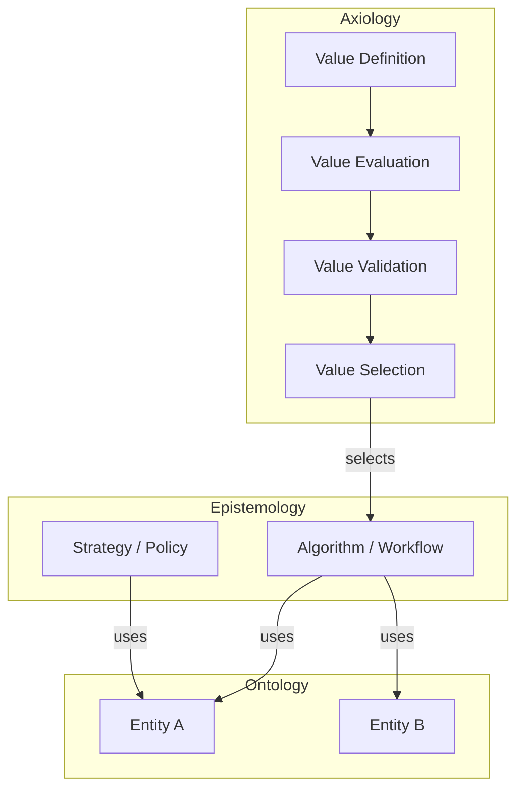

# AEO Skill

Apply the **Axiology → Epistemology → Ontology** philosophy to software tasks. The three layers answer:

- **Axiology (Value / Why)** — what outcomes matter and how to evaluate them
- **Epistemology (Method / How)** — how to achieve those outcomes: algorithms, workflows, decisions
- **Ontology (Existence / What)** — what stable entities must exist for the system to function

Design direction: Axiology first → Epistemology second → Ontology last (but iteration is expected).

---

## Output and Book Setup

All AEO outputs are written as markdown files into `.aeo/src/` and rendered with mdbook.

### Check for existing book

Before producing any output, check whether `.aeo/book.toml` exists:

```bash
ls .aeo/book.toml 2>/dev/null
```

If it does **not** exist, initialize the book first (see **Initializing the AEO Book** below), then proceed with the task.

### Writing output files

- **Design / Architecture** → `.aeo/src/design/<slug>.md`
- **Code Review** → `.aeo/src/reviews/<slug>.md`
- **Refactoring Plan** → `.aeo/src/refact/<slug>.md`
- **Implementation Plan** → `.aeo/src/impl/<slug>.md`
- **Documentation** → `.aeo/src/docs/<slug>.md`

Use a short kebab-case slug based on the subject (e.g., `recommendation-engine.md`, `user-plan-selector.md`).

After writing, add the file as a nested entry under the appropriate chapter in `.aeo/src/SUMMARY.md`. Then build:

```bash
cd .aeo && mdbook build 2>&1
```

Fix any errors before reporting to the user.

---

## Initializing the AEO Book

Run this only when `.aeo/book.toml` does not exist.

### Step 1: Install tooling if needed

```bash
which mdbook || cargo install mdbook
which mdbook-mermaid || cargo install mdbook-mermaid
```

If `cargo` is not available, tell the user to install Rust first: https://www.rust-lang.org/tools/install

### Step 2: Initialize and configure

```bash
mdbook init .aeo --title "AEO" --ignore git
mdbook-mermaid install .aeo/
```

Replace `.aeo/book.toml` with:

```toml
[book]
language = "en"
src = "src"
title = "AEO"

[preprocessor.mermaid]
command = "mdbook-mermaid"

[output.html]
additional-js = ["mermaid.min.js", "mermaid-init.js"]
```

### Step 3: Create chapter directories and SUMMARY.md

```bash
mkdir -p .aeo/src/design .aeo/src/reviews .aeo/src/refact .aeo/src/impl .aeo/src/docs
```

Write `.aeo/src/SUMMARY.md`:

```markdown
# Summary

- [Design](./design/index.md)
- [Code Reviews](./reviews/index.md)
- [Refactoring Plans](./refact/index.md)
- [Implementation Plans](./impl/index.md)
- [Documentation](./docs/index.md)
```

Create an `index.md` stub in each chapter directory:

```markdown
# <Chapter Name>

_No entries yet._
```

### Step 4: Build check

```bash
cd .aeo && mdbook build 2>&1
```

Fix all errors before proceeding to the actual task.

---

## The Three Layers in Detail

### Axiology — Value
Axiology does not execute behavior. It governs which behavior gets chosen and whether results are acceptable.

Four components:
| Component | Role |
|---|---|
| **Value Definition** | What matters and how much (weights, priorities) |
| **Value Evaluation** | Measures how good a result is |
| **Value Validation** | Enforces minimum acceptable thresholds |
| **Value Selection** | Picks the best option among candidates |

Design signal: if code is choosing between options, scoring outputs, or enforcing thresholds — that's Axiology. Keep it explicit and encoded in logic, not buried in comments or implicit in control flow.

### Epistemology — Method
Epistemology executes behavior using Ontological objects to realize Axiological goals.

Characteristics:
- Algorithms, decision trees, workflows, interaction patterns
- Composable and replaceable units (strategies, policies, pipelines)
- Does not define what is valuable — it receives that from Axiology
- Does not define what exists — it uses what Ontology provides

Design signal: if code describes *how* to do something step-by-step, it belongs here. Structure it so the method can be swapped without changing the value layer or the entity layer.

### Ontology — Existence
Ontology defines stable entities: their properties, behaviors, and relationships.

Key principle: an Ontological object stays the same across different perspectives. If an entity changes shape depending on *who* is using it, it's leaking Epistemology or Axiology into Ontology — a design smell.

Design signal: domain models, core data structures, entity types. They should be usable by multiple Epistemologies without modification.

---

## Modes of Operation

### Design / Architecture

1. **Axiology first** — identify the values: what outcomes matter? what does success look like? what must never happen?
2. **Epistemology second** — design the methods: what algorithms, workflows, or decision processes realize those values?
3. **Ontology last** — identify the stable entities the methods will operate on.
4. Use a Mermaid diagram to show the layer relationships and component structure.
5. Call out any leakage between layers (e.g., Ontology shaped by a single use case).
6. Write the result to `.aeo/src/design/<slug>.md`.

**Mermaid diagram template for design architecture:**

````markdown

````

Adapt the nodes to the actual system being designed. Always include this diagram in design outputs.

### Code Review

For each piece of code, identify which layer it belongs to and flag violations:
- Axiology mixed into Epistemology (e.g., scoring logic tangled with execution logic)
- Ontology shaped by a specific Epistemology (entity changes shape for one caller)
- Missing Axiology (selection/evaluation done implicitly, not explicitly)
- Monolithic code where all three layers are entangled

Structure each finding as: **[Layer] Issue → Why it matters → Suggested fix**

Write the full review to `.aeo/src/reviews/<slug>.md`.

### Implementation and Refactoring — Plan First

For implementation and refactoring requests, **always write a plan before touching any code**.

**Step 1 — Write the plan** to `.aeo/src/impl/<slug>.md` or `.aeo/src/refact/<slug>.md`:

```markdown
# Plan: <short title>

## AEO Layer Mapping
<describe which layer each component belongs to>

## Architecture Diagram
<mermaid diagram showing layer structure and component relationships>

## Steps
1. ...
2. ...

## Files to create / modify
| File | Change |
|------|--------|
```

Include a Mermaid diagram in the plan showing the target layer structure.

**Step 2 — Ask for confirmation:**

> "Here's the plan. Does this look right? I'll proceed once you confirm."

**Step 3 — Execute only after confirmation.** Do not write or modify source code before the user approves the plan.

### Documentation

Structure documentation around the three layers:
- **Why** section: values, goals, success criteria (Axiology)
- **How** section: methods, workflows, decision logic (Epistemology)
- **What** section: entities, their properties and relationships (Ontology)

Write to `.aeo/src/docs/<slug>.md`.

---

## Common Design Smells

| Smell | Likely cause |
|---|---|
| Selection logic duplicated across callers | Axiology not extracted |
| Entity has different shapes for different callers | Ontology polluted by Epistemology |
| Algorithm hard-coded with magic thresholds | Axiology mixed into Epistemology |
| "God object" that evaluates, executes, and models | No layer separation at all |
| Value only in docs, not in code | Axiology implicit rather than encoded |

---

## Output Principles

- Always name which layer you're discussing
- When identifying violations, explain *why* it's a problem (not just which rule it breaks)
- Be concrete: show the code change or the structure, not just the concept
- Use Mermaid diagrams when explaining design architecture — not for simple notes
- Write all outputs to the appropriate `.aeo/src/` subdirectory and build the book
- For implementation and refactoring: plan → confirm → execute. Never skip the confirmation step
- If layers are cleanly separated already, say so — don't invent problems
