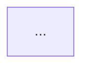

# Architectural Decision Record (ADR)

Every change — new feature, refactoring, or architecture design — is an ADR. There are no separate document types.

Output: `.aeo/src/adr/<ID>-<slug>.md`

## ID assignment

```bash
ls .aeo/src/adr/*.md 2>/dev/null | wc -l
```

Zero-padded 4-digit format: `0001`, `0002`, etc.

---

## Step 1: Grill-me (reach shared understanding before writing)

Interview the user relentlessly about every aspect of this decision until reaching shared understanding. Walk down each branch of the decision tree, resolving dependencies between decisions one by one.

- Ask questions **one at a time**
- For each question, provide your **recommended answer** so the user can confirm, correct, or refine
- If a question can be answered by **exploring the codebase**, do that instead of asking

Stop when every branch of the decision tree is resolved and both sides see the problem the same way.

---

## Step 2: Deep Module check (before writing the ADR)

Before writing, assess the affected code for these smells:

| Smell | What to look for |
|---|---|
| **Shallow module** | Interface nearly as wide as the implementation — many tiny methods |
| **Duplicated logic** | Same rule or algorithm in more than one place |
| **Information leakage** | Same knowledge scattered across call sites instead of owned by one module |
| **Temporal decomposition** | Split by execution order rather than responsibility |
| **Pass-through method** | A function that just calls another with the same arguments |
| **Leaky interface** | Callers must know internal details to use the module correctly |
| **Conjoined twins** | Two modules always edited together — should probably be one |

A good module has an interface simpler than its implementation. If a proposed change makes an interface wider, question it.

---

## Step 3: ADR template

```markdown
# [ID] Title

**Status:** Proposed | Accepted | Deprecated | Superseded by [ID]

## Context

What triggered this decision? What problem, need, or violation prompted it?
What constraints are in play?

## Decision

What was decided and why. Walk through the three layers:

**Value** — What does the end user need from this? Which features are worth
building? What does success look like? What must never happen?

**Method** — How is the need met? Which entities are used and from which angle?
What algorithm or workflow produces the outcome?

**Entity** — What objects must exist? Each entity must have more than just
data — it should own properties, actions, behaviors, and relationships relevant
to its concern. If logic that belongs to an entity lives outside it, the entity
is too thin. Are the entities stable and invariant across different uses? Is the
abstraction level right — not too large, not too small?

Call out any leakage between layers.

## Alternatives Considered

Other options evaluated and why they were ruled out.

## Consequences

Trade-offs, risks, and what this decision makes easier or harder.

## Before / After

Show the current structure and the target structure.
For a greenfield decision, show only the target.
Keep each diagram focused on one concern — split if it gets large.

**Before:**


**After:**


## Step-by-Step Plan

Ordered tasks. Name each file, what it does, and which layer it belongs to.
Use the project's own directory naming — the label in brackets shows the layer.

1. Create `src/models/user.ts` — User entity [entity]
2. Create `src/services/auth.ts` — authentication workflow [method]
3. Create `src/commands/login.ts` — login use-case entry point [value]
4. ...
```

After writing the ADR, ask the user to confirm before writing any code.

---

## After implementation is confirmed

Once the user has reviewed the code:

1. Update the documentation — read `references/docs.md`
2. Mark the ADR status as `Accepted`

## SUMMARY.md entry

```markdown
  - [[<ID>] <title>](./adr/<ID>-<slug>.md)
```
