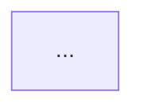

# Architectural Decision Record (ADR)

Every change — new feature, refactoring, or architecture design — is an ADR. There are no separate document types.

Output: `.aeo/src/adr/<ID>-<slug>.md`

For layer definitions, read `references/layers.md`.
For deep module principles, read `references/deep-modules.md`.

## ID assignment

```bash
ls .aeo/src/adr/*.md 2>/dev/null | wc -l
```

Zero-padded 4-digit format: `0001`, `0002`, etc.

---

## Step 1: Grill-me (reach shared understanding before writing)

Interview me relentlessly about every aspect of this plan until reaching shared understanding. Walk down each branch of the decision tree, resolving dependencies between decisions one by one.

- Ask questions **one at a time**
- For each question, provide your **recommended answer** so the user can confirm, correct, or refine
- Start from the highest-level perspective and narrow down to details.

If a question can be answered by exploring the codebase, explore the codebase instead.

---

## Step 2: ADR template

```markdown
# [ID] Title

**Status:** Proposed | Accepted | Deprecated | Superseded by [ID]

## Context

What triggered this decision? What problem, need, or violation prompted it?
What constraints are in play?

## User Stories

A numbered list covering all aspects of the change from the user's perspective.

1. As a <actor>, I want <feature>, so that <benefit>
2. ...

## Decision

What was decided and why. Walk through the three layers:

**Value** — What does the end user need from this? Which features are worth
building? What does success look like? What must never happen?

**Method** — How is the need met? Which entities are used and from which angle?
What algorithm or workflow produces the outcome?

**Entity** — What objects must exist? Each entity must have more than just
data — it should own properties, actions, behaviors, and relationships relevant
to its concern. If logic that belongs to an entity lives outside it, the entity
is too thin. Are the entities stable and invariant across different uses? Is the
abstraction level right — not too large, not too small?

For each relationship: cardinality, ownership, navigability, aggregate boundary.
View-specific joins belong in the method layer.

Call out any leakage between layers.

## Alternatives Considered

Other options evaluated and why they were ruled out.

## Consequences

Trade-offs, risks, and what this decision makes easier or harder.

## Testing Decisions

- What makes a good test for this change (test external behavior, not implementation details)
- Which modules will be tested and why
- Prior art in the codebase for similar tests

## Out of Scope

What is explicitly not part of this decision.

## Before / After

Show the current structure and the target structure.
For a greenfield decision, show only the target.
Keep each diagram focused on one concern — split if it gets large.

**Before:**


**After:**


## Step-by-Step Plan

Each item is one RED→GREEN TDD cycle. Order from the most end-to-end behavior (tracer bullet) to the most specific.

For each item:
- **Behavior** — what the system does (maps to a User Story)
- **Test target** — which public interface to test through (value entry point, entity action)
- **File** — what to create or modify, and which layer `[value|method|entity]`

Example:

1. User can log in with valid credentials
   - Test: call `login(email, password)` → returns session token
   - Files: `src/commands/login.ts` [value], `src/services/auth.ts` [method]
2. User entity validates its own password hash
   - Test: `user.verifyPassword(plain)` → true/false
   - Files: `src/models/user.ts` [entity]
3. ...
```

After writing the ADR, ask the user to confirm before writing any code.

---

## After implementation is confirmed

Once the user has reviewed the code:

1. Update the documentation — read `references/docs.md`
2. Mark the ADR status as `Accepted`

## SUMMARY.md entry

```markdown
  - [[<ID>] <title>](./adr/<ID>-<slug>.md)
```
