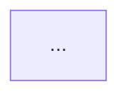

# Design / Architecture Mode

Output: `.aeo/src/design/<ID>-<slug>.md`

## ID assignment

```bash
ls .aeo/src/design/*.md 2>/dev/null | wc -l
```

Zero-padded 4-digit format: `0001`, `0002`, etc.

## Document structure (ADR format)

Each design document is an Architecture Decision Record. Use this structure:

```markdown
# [ID] Title

**Status:** Proposed | Accepted | Deprecated | Superseded by [ID]

## Context

Why is this decision being made? What problem or goal triggers this design?
What constraints or forces are in play?

## Decision

What was decided, and why. Walk through the three AEO layers:

**Axiology** — What does the end user need from this? Which features are worth
building and why? What does a good result look like from the user's perspective?
What must never happen?

**Epistemology** — From which aspect(s) are the objects being used?
What algorithm makes the decision? How do components interact?

**Ontology** — What entities must exist? Are they stable and invariant?
Is the abstraction level right — not too large, not too small?

Call out any leakage between layers.

## Alternatives Considered

List the other options evaluated and why they were rejected.

## Consequences

Trade-offs, risks, and what this decision makes easier or harder going forward.

## Before / After

If this design changes an existing system, show a before/after Mermaid diagram.
If it is greenfield, show only the target architecture diagram.



## Step-by-Step Plan

Ordered tasks to realize this design. Each step names the file or component
and which AEO layer it belongs to.

1. Step one — `path/to/file.ts` (Ontology)
2. Step two — `path/to/service.ts` (Epistemology)
3. ...
```

After writing the document, ask the user to confirm before starting implementation.

## SUMMARY.md entry

```markdown
  - [[<ID>] <title>](./design/<ID>-<slug>.md)
```
