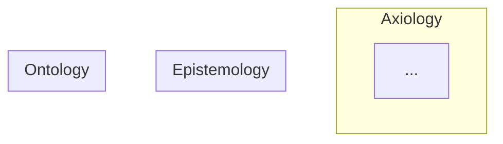

# Design / Architecture Mode

Output: `.aeo/src/design/<ID>-<slug>.md`

## ID assignment

Check the existing files to get the next ID:

```bash
ls .aeo/src/design/*.md 2>/dev/null | wc -l
```

Use zero-padded 4-digit format: `0001`, `0002`, etc.

## File structure

```markdown
# [<ID>] Design: <title>

Brief description of the system and its purpose.

## Axiology — Value

### Value Definition
<what matters and how much>

### Value Evaluation
<how results are measured>

### Value Validation
<minimum acceptable thresholds>

### Value Selection
<how the best option is chosen>

## Epistemology — Method

### Workflow
<step-by-step process>

### Decision Logic
<how choices are made>

### Composable Units
<strategies, policies, pipelines and how they can be swapped>

## Ontology — Entities

### <Entity Name>
**Properties**: ...
**Behaviors**: ...
**Relationships**: ...
**Invariant**: <what stays the same regardless of which Epistemology uses it>

## Architecture Diagram



## Layer Violations / Risks
<any cross-layer leakage identified — omit section if none>
```

## SUMMARY.md entry

```markdown
  - [[<ID>] <title>](./design/<ID>-<slug>.md)
```
