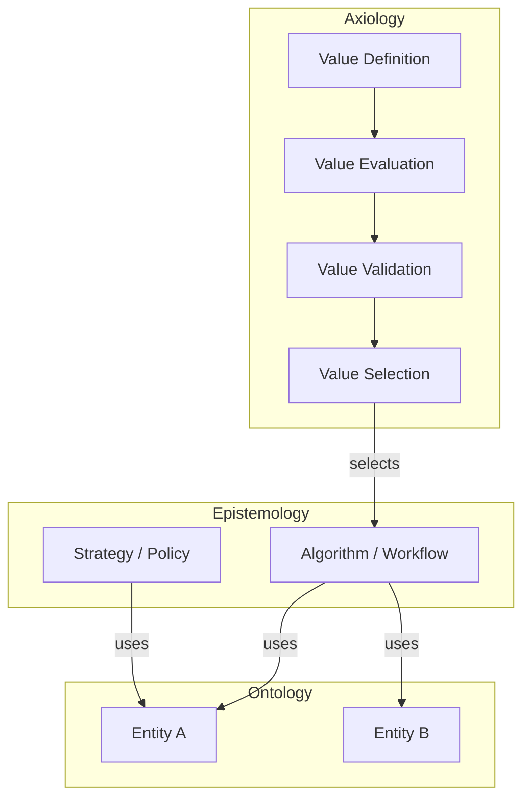

# Design / Architecture Mode

Output file: `.aeo/src/design/<slug>.md`

## Process

1. **Axiology first** — what outcomes matter? what does success look like? what must never happen?
2. **Epistemology second** — what algorithms, workflows, or decision processes realize those values?
3. **Ontology last** — what stable entities do the methods operate on?
4. Include a Mermaid diagram showing the layer relationships and component structure.
5. Call out any leakage between layers.

## Mermaid diagram template

Adapt the nodes to the actual system. Always include this in design outputs.

````markdown

````

## Output structure

```markdown
# Design: <title>

## Axiology
<values, success criteria, what must never happen>

## Epistemology
<methods, workflows, decision logic>

## Ontology
<stable entities and their relationships>

## Architecture Diagram
<mermaid diagram>

## Layer Violations / Risks
<any leakage or design smells identified>
```

Add the file as a nested entry in `.aeo/src/SUMMARY.md` under `Design`.
