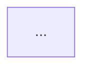

# Documentation Mode

Documentation is structured like a textbook — a named book with chapters, each chapter covering one coherent topic. Every chapter is a separate file. The book grows as new topics are documented.

## Directory structure

```
.aeo/src/docs/
├── index.md              — book introduction and table of contents
├── 01-<topic>/
│   ├── index.md          — chapter introduction and section links
│   ├── 01-axiology.md    — Why: values, goals, success criteria
│   ├── 02-epistemology.md — How: methods, workflows, decision logic
│   ├── 03-ontology.md    — What: entities, properties, relationships
│   └── 04-diagram.md     — Architecture diagram for this topic
├── 02-<topic>/
│   └── ...
```

Number chapters and sections so they sort correctly in the sidebar. Name directories and files with kebab-case slugs.

## docs/index.md — Book introduction

```markdown
# AEO Documentation

This book documents the system using the AEO framework.

## Chapters

- [Chapter 1: <Topic>](./01-<topic>/index.md)
- [Chapter 2: <Topic>](./02-<topic>/index.md)
```

## Chapter index.md — Chapter introduction

```markdown
# Chapter N: <Topic>

One paragraph introducing what this chapter covers and why it matters.

## Sections

- [Axiology — Why](./01-axiology.md)
- [Epistemology — How](./02-epistemology.md)
- [Ontology — What](./03-ontology.md)
- [Diagram](./04-diagram.md)
```

## Section files

**01-axiology.md**
```markdown
# Axiology — Why

## Value Definition
<what matters and how much>

## Value Evaluation
<how results are measured>

## Value Validation
<minimum acceptable thresholds>

## Value Selection
<how the best option is chosen>
```

**02-epistemology.md**
```markdown
# Epistemology — How

## Workflow
<step-by-step process>

## Decision Logic
<how choices are made>

## Composable Units
<strategies, policies, pipelines>
```

**03-ontology.md**
```markdown
# Ontology — What

## <Entity Name>
**Properties**: ...
**Behaviors**: ...
**Relationships**: ...
**Invariant**: ...
```

**04-diagram.md**
```markdown
# Architecture Diagram


```

Include a Mermaid diagram by default. Only omit if the topic is trivially simple.

## Adding a new chapter

When the user asks to document a new topic, create a new numbered chapter directory with its four section files and update both `docs/index.md` and `SUMMARY.md`.

## SUMMARY.md entries

Add each new chapter as a nested group:

```markdown
- [Documentation](./docs/index.md)
  - [Chapter 1: <Topic>](./docs/01-<topic>/index.md)
    - [Axiology](./docs/01-<topic>/01-axiology.md)
    - [Epistemology](./docs/01-<topic>/02-epistemology.md)
    - [Ontology](./docs/01-<topic>/03-ontology.md)
    - [Diagram](./docs/01-<topic>/04-diagram.md)
```
