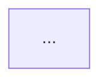

# Implementation and Refactoring Mode

**Always write the plan file and get confirmation before touching any code.**

---

## Implementation

Output: `.aeo/src/impl/<ID>-<slug>.md`

### ID assignment

```bash
ls .aeo/src/impl/*.md 2>/dev/null | wc -l
```

Use zero-padded 4-digit format: `0001`, `0002`, etc.

### File structure

```markdown
# [<ID>] Implementation Plan: <title>

Brief description of what is being built.

## AEO Layer Mapping

| Component | Layer | Reason |
|-----------|-------|--------|

## Architecture Diagram



## Steps

1. ...
2. ...

## Files to Create

| File | Layer | Purpose |
|------|-------|---------|
```

The Mermaid diagram is required — it makes the layer structure unambiguous before any code is written.

After writing the file, ask:

> "Here's the implementation plan. Does this look right? I'll write the code once you confirm."

Do not write source code before the user confirms.

### SUMMARY.md entry

```markdown
  - [[<ID>] <title>](./impl/<ID>-<slug>.md)
```

---

## Refactoring

Output: `.aeo/src/refact/<ID>-<slug>.md`

### ID assignment

```bash
ls .aeo/src/refact/*.md 2>/dev/null | wc -l
```

### File structure

```markdown
# [<ID>] Refactoring Plan: <title>

Brief description of what is being refactored.

## Current Layer Violations

| Location | Violation | Layer |
|----------|-----------|-------|

## Before

```mermaid
...
```

## After

```mermaid
...
```

## Steps

1. Extract Axiology: ...
2. Extract Epistemology: ...
3. Stabilize Ontology: ...

## Files to Modify

| File | Change |
|------|--------|
```

Both before/after diagrams are required. They are the most important part of a refactoring plan — they make the intent unambiguous before any code is touched.

After writing the file, ask:

> "Here's the refactoring plan. Does this look right? I'll apply the changes once you confirm."

Do not modify source code before the user confirms.

### SUMMARY.md entry

```markdown
  - [[<ID>] <title>](./refact/<ID>-<slug>.md)
```
