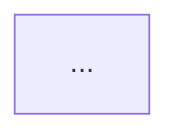

# Implementation and Refactoring Mode

**Always write the plan file and get confirmation before touching any code.**

---

## Implementation

Output: a single file `.aeo/src/impl/<slug>.md`

### File structure

```markdown
# Implementation Plan: <title>

Brief description of what is being built.

## AEO Layer Mapping

| Component | Layer | Reason |
|-----------|-------|--------|

## Architecture Diagram



## Steps

1. ...
2. ...

## Files to Create

| File | Layer | Purpose |
|------|-------|---------|
```

A Mermaid diagram is required in every implementation plan — it makes the layer structure unambiguous before any code is written.

After writing the file, ask:

> "Here's the implementation plan. Does this look right? I'll write the code once you confirm."

Do not write source code before the user confirms.

### SUMMARY.md entry

```markdown
  - [<title>](./impl/<slug>.md)
```

---

## Refactoring

Output: a single file `.aeo/src/refact/<slug>.md`

### File structure

```markdown
# Refactoring Plan: <title>

Brief description of what is being refactored.

## Current Layer Violations

| Location | Violation | Layer |
|----------|-----------|-------|

## Structure Diagram

### Before (tangled)
```mermaid
...
```

### After (separated)
```mermaid
...
```

## Steps

1. Extract Axiology: ...
2. Extract Epistemology: ...
3. Stabilize Ontology: ...

## Files to Modify

| File | Change |
|------|--------|
```

The before/after diagram is the most important part — it makes the intent unambiguous. Required, do not skip.

After writing the file, ask:

> "Here's the refactoring plan. Does this look right? I'll apply the changes once you confirm."

Do not modify source code before the user confirms.

### SUMMARY.md entry

```markdown
  - [<title>](./refact/<slug>.md)
```
