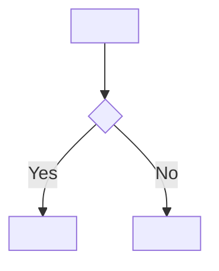

# Cascade: SAD → SDD and UT

When SAD items are marked `reviewed`, create corresponding SDD and UT items. This connects the "how at component level" (architecture) to the "how at function level" (detailed design).

---

## Find next available IDs

```bash
ls book/src/sdd/ | grep "^SDD-[0-9]" | sort -t- -k2 -n | tail -1
ls book/src/ut/  | grep "^UT-[0-9]"  | sort -t- -k2 -n | tail -1
```

---

## SDD item template

Create one `book/src/sdd/SDD-{NNN}.md` per function or class method defined in the SAD component's `## Interface`. Each SDD item designs one function in enough detail that someone can write the body without guessing.

```markdown
# SDD-{NNN}: <ClassName.methodName() or module-level function name>

## State
`draft`

## Tags
`#tag1`

## Why
<one sentence — why this function exists and what behavior it implements within its parent component>

## Traces
- ← [SAD-{NNN}](../sad/SAD-{NNN}.md): <why this function is the implementation of a specific responsibility declared in the parent SAD component>
- → [UT-{NNN}](../ut/UT-{NNN}.md): <which behavior of this function the unit test covers>

## Diagram



_Omit diagram if the algorithm is a straight sequence with no branches._

## Signature
`<functionName>(param: Type, ...): ReturnType`

## Algorithm
1. <Step 1 — specific action, not vague>
2. <Step 2>
3. ...

## Variables
- `<varName>: <Type>` — <purpose>

## Error cases
- `<ErrorType>` — <when this is raised and what caused it>

## Side effects
<what is written/read/mutated beyond the return value, or "none">

> **Review needed** — <question about algorithm detail, error handling, or edge case>
```

Add to `SUMMARY.md` under Detailed Design and add a row to `book/src/sdd/index.md`.

---

## UT item template

Create one `book/src/ut/UT-{NNN}.md` per significant behavior or edge case in the SDD item. A single SDD item typically yields multiple UT items (happy path, error paths, edge cases).

```markdown
# UT-{NNN}: <test title describing the specific case>

## State
`draft`

## Tags
`#tag1`

## Why
<one sentence — what specific function behavior or edge case this test validates and why it matters>

## Traces
- ← [SDD-{NNN}](../sdd/SDD-{NNN}.md): <which specific algorithm step, error case, or behavior defined in SDD this test validates>

## Function
`<functionName>()`

## Case
<what specific scenario this tests — e.g., "wrong password increments failure counter">

## Input
<specific input values — concrete, not generic>

## Expected output
<specific return value or side effect — measurable, not vague>

> **Review needed** — <question about edge case coverage or test input values>
```

Add to `SUMMARY.md` under Unit Tests and add a row to `book/src/ut/index.md`.

---

## After creating SDD and UT items

1. Add `→ [SDD-{NNN}](../sdd/SDD-{NNN}.md): <why>` to the reviewed SAD item's Traces section (replace the `TBD` placeholder if it was left there)
2. Update `book/src/sdd/index.md` traceability table with new SDD rows
3. Update `book/src/ut/index.md` traceability table with new UT rows
4. Update `book/src/tags.md` for any new tags used
