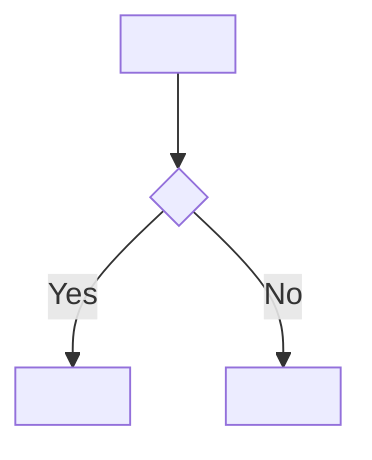

# sophist-lazy: Full Pipeline — Requirement to SDD in One Pass

**Goal**: Take a customer requirement and produce a complete CuRS → SRS → SAD → SDD chain without pausing for human review.

Read before starting:
- `../sophist-shared/workflow.md` — pipeline order and item states; sophist-lazy replaces the curs → srs → sad → sdd review steps with lazy assumptions
- `../sophist-shared/items.md` — SAD and SDD item templates (Debug strategy / Debug trace bullet format)

If `.sophist/src/goal.md` exists, read it before starting — it describes the project's stated purpose and helps orient the lazy assumptions you'll be making throughout the pipeline. Every time a review point would normally block forward progress, make an explicit lazy assumption instead and write implementation-level observability specs into the SAD and SDD so that:
- sophist-impl knows exactly *what* to emit and *where* to place it
- the human can see, in running logs/metrics, precisely which unreviewed assumption fired

The guiding principle: what isn't reviewed at design time must be *observable* at runtime. A lazy assumption that turns out to be wrong should produce a clear, traceable signal — not a silent mismatch.

---

## Step 0: Get the requirement

If the human has not provided a requirement, ask:

> "What does the customer need? Describe it in plain terms — I'll handle the translation into SOPHIST items."

Accept any form: a sentence, a paragraph, a user story, a feature name.

---

## Step 1: CuRS pass

### 1a. Check for existing coverage

```bash
ls .sophist/src/curs/ | grep "^CuRS-" | sort -t- -k2 -n | tail -1
grep -ril "<keyword>" .sophist/src/curs/ .sophist/src/srs/
```

If a full duplicate exists, stop and tell the human. If partial overlap, note it and continue.

### 1b. Create the CuRS item

Record the customer's words accurately — do not over-interpret.

```markdown
# CuRS-{NNN}: <short title>

## State
`draft`

## Tags
`#lazy`

## Why
<one sentence — business motivation>

## Traces
- → [SRS-{NNN}](../srs/SRS-{NNN}.md): <aspect being formalized>

## Input
> "<customer's words verbatim or near-verbatim>"

## Context
<when stated and any relevant background>

### Review needed
confirm this captures the customer's intent accurately

**Lazy assumption**: taken at face value — no alternative interpretation attempted
```

Add a row to `.sophist/src/curs/index.md` and an entry to `SUMMARY.md`.

---

## Step 1b: Debugger cross-cutting concern

Check whether a Debugger CuRS exists in the project:

```bash
grep -rl "#debug" .sophist/src/curs/ 2>/dev/null
```

If no Debugger CuRS exists **and** the requirement being pipelined involves multi-step behavior across components (i.e., the SAD pass will produce a `sequenceDiagram` with multiple participants), create a Debugger CuRS before proceeding. Tag it `#debug` and apply the lazy assumption protocol.

```markdown
# CuRS-{NNN}: Runtime debuggability

## State
`draft`

## Tags
`#debug` `#lazy`

## Why
Operators need to inspect runtime behavior — both event traces and structured state snapshots — without rebuilding the software.

## Traces
- → [SRS-{NNN}](../srs/SRS-{NNN}.md): debug level, output destination, and data file format

## Input
> "operators shall be able to set debug verbosity and output directory via CLI options without rebuilding the software"

## Context
Added automatically by sophist-lazy because the pipeline produces multi-component interactions.

### Review needed
confirm `--debug-level` scale, `--debug-output-dir` usage, and log format match project constraints

**Lazy assumption**: single Debugger component with `--debug-level=OFF|INFO|DEBUG|VERBOSE` and `--debug-output-dir=<path>`; exposes `info/debug/verbose/warning/error(msg)` for log lines; `write(filename, data, purpose)` for structured data files (active when `--debug-output-dir` is set, regardless of `--debug-level`; appends sequence index on filename collision; logs file path and purpose to main log); `subprocess_log_path(name)` returns a per-subprocess log file path (main log records path and timing); log lines include `filename:line_number`; all output routes through the Debugger — components never write to the filesystem directly
**Guard level**: `log`
**Lazy ID**: L-{NNN}
```

Then derive SRS, SAD, and SDD items for the Debugger the same way as any other pipeline item (Steps 2–4 below). The Debugger SAD item's `## Interface` defines log methods, `write()`, and `subprocess_log_path()` — sophist-impl will import from it for all other SAD components in the project.

If a Debugger CuRS already exists, skip this step.

---

## Step 2: SRS pass

Derive SRS items from the CuRS item. Each must be testable.

```markdown
# SRS-{NNN}: <requirement title>

## State
`draft`

## Tags
`#lazy`

## Why
<one sentence>

## Traces
- ← [CuRS-{NNN}](../curs/CuRS-{NNN}.md): <derivation rationale>
- → [AT-{NNN}](../at/AT-{NNN}.md): <what the acceptance test validates>

## Description
<Requirement text — "shall" for mandatory, "should" for preferred.>
```

For each ambiguity (scope, performance, actor, error behavior, interface contract), apply the lazy assumption protocol:

```markdown
### Review needed
<original question>

**Lazy assumption**: <what was assumed and why>
**Guard level**: `assert` | `log` | `monitor` | `must-review`
**Lazy ID**: L-{NNN}
```

Assign a sequential Lazy ID (`L-001`, `L-002`, …) to every assumption across the entire pipeline run. Add each to the lazy log (Step 5).

**Guard level guide**:

| Level | When to use | Runtime behavior |
|---|---|---|
| `must-review` | Security, auth, data integrity — wrong assumption causes harm | Panics at startup; blocks the process from running |
| `assert` | Functional invariant — wrong assumption causes incorrect behavior | Hard failure at the call site with a traceable message |
| `log` | Soft assumption — wrong assumption degrades quality but doesn't break | Warning on first occurrence; program continues |
| `monitor` | Scale or performance assumption | Metric counter/histogram; surfaced in dashboards |

Create the AT item too (`.sophist/src/at/AT-{NNN}.md`).

---

## Step 3: SAD pass

Derive SAD components from SRS items. Apply the lazy assumption protocol for every open question. The key addition over a normal SAD item is `## Lazy observability` — a concrete implementation spec for component-level instrumentation.

```markdown
# SAD-{NNN}: <component title>

## State
`draft`

## Tags
`#lazy`

## Why
<one sentence>

## Traces
- ← [SRS-{NNN}](../srs/SRS-{NNN}.md): <responsibility derivation>
- → [SDD-{NNN}](../sdd/SDD-{NNN}.md): <function to be designed>

## Static View

```mermaid
graph LR
  <CallerComponent> --> SAD-{NNN}["<ComponentName><br/><file path>"]
  SAD-{NNN} --> <DependencyComponent>
```

## Dynamic View

```mermaid
sequenceDiagram
  participant <Caller>
  participant <ComponentName>
  participant <Dependency>
  <Caller>->><ComponentName>: <primary method call>
  <ComponentName>->><Dependency>: <internal call>
  <Dependency>-->><ComponentName>: <response>
  <ComponentName>-->><Caller>: <result>
```

## Responsibility
<What this component owns. Prefer deep modules — hide decisions inside,
expose only what callers need to know.>

## Interface
<Public API surface — function names, inputs, outputs, errors raised>

## Location
`src/<path>/<filename>`

## Dependencies
- [SAD-{MMM}](SAD-{MMM}.md): <why>

## Debug strategy
**Healthy trace**: <what log messages appear in order when this component executes correctly>
**Key observables**: <which variables or state values are most diagnostic>
**Failure signatures**:
- <failure mode>: <log pattern or missing output that indicates this failure>
**Diagnostic process**: <step-by-step how to isolate a bug in this component>

**Debug data model** (written to `--debug-output-dir` when set — active even without `--debug-level`):

| File | Format | When written | Purpose | Contents |
|------|--------|-------------|---------|---------|
| `<filename>.<ext>` | JSON \| log \| csv \| <other> | <trigger condition> | <why this file exists — what question it answers> | <fields or entries> |

## Lazy observability
These are component-level instrumentation points.
sophist-impl must emit each one at the described location when implementing this component.

| L-ID | Where | Kind | Implementation line |
|------|-------|------|---------------------|
| L-002 | module load / `__init__` | `must-review` | `raise AssertionError("LAZY-L-002 [SAD-NNN]: <assumption> — must be reviewed before deploy")` |
| L-003 | component initialisation | `log` | `logger.warning("LAZY-L-003 [SAD-NNN]: <assumption> — unreviewed, monitor for unexpected behaviour")` |
| L-004 | first public method call | `monitor` | `metrics.increment("lazy.sad_nnn.<assumption_slug>")` |
```

The `Where` column must be specific enough for sophist-impl to place the line without guessing: `module load`, `__init__`, `connect()`, `first call to process()`, etc.

---

## Step 4: SDD pass

Derive SDD items from each SAD component. This is the most critical layer for observability: guards are embedded **inside `## Algorithm` steps** at the exact position they belong, so sophist-impl has no ambiguity about placement. A summary table `## Lazy contracts` lists them all for human scanning.

```markdown
# SDD-{NNN}: <function title>

## State
`draft`

## Tags
`#lazy`

## Why
<one sentence>

## Traces
- ← [SAD-{NNN}](../sad/SAD-{NNN}.md)
- → [UT-{NNN}](../ut/UT-{NNN}.md)

## Static View

```mermaid
graph LR
  <ParentModule>["<ClassName or Module>"] --> fn["<functionName>()"]
  <ParentModule> --> sibling1["<siblingFunction>()"]
  fn --> sibling1
```

## Dynamic View



## Signature
<function_name(param: Type, ...) -> ReturnType>

## Algorithm
1. <step>
2. <step>
...

## Variables
| Name | Type | Purpose |
|------|------|---------|

## Error cases
| Condition | Behavior |
|-----------|----------|

## Side effects
<none | list>

## Debug trace
**Happy path**: <ordered log messages for a successful execution>
**Error paths**:
- `<ErrorType>`: <log messages and variable values that identify this error>
**Key variables**: <runtime values most useful for diagnosing a failure in this function>
**Analysis guide**: <how to interpret the data files and log sequence to diagnose a failure — e.g. "check entry.json inputs first, then whether error.json exists; if absent, failure occurred after the function returned">

**Debug data model** (written to `--debug-output-dir` when set — active even without `--debug-level`):

| File | Format | When written | Purpose | Contents |
|------|--------|-------------|---------|---------|
| `<filename>.<ext>` | JSON \| log \| csv \| <other> | on entry \| on error \| on return \| always | <why this file exists — what question it answers> | <exact fields — specific enough to implement without guessing> |

## Lazy contracts
<Summary of all lazy guards in this function — for human review.
Each row maps to a `[LAZY L-NNN]` marker in the Algorithm above.>

| L-ID | Assumption | Kind | Implementation line |
|------|-----------|------|---------------------|
```

### Embedding guards in the Algorithm

When a lazy assumption affects a specific point in the function's execution, add a `[LAZY L-NNN]` step at that exact position:

```markdown
## Algorithm
1. [LAZY L-001] Precondition check — assert input contract assumed in SRS-007:
   `assert isinstance(user_id, str) and len(user_id) > 0, "LAZY-L-001 [SRS-007]: assumed non-empty string user_id — review input contract"`
2. Fetch user record from db using user_id
3. If record not found → raise `UserNotFoundError`
4. Validate password hash against stored hash
5. [LAZY L-005] Log soft assumption about token expiry format:
   `logger.warning("LAZY-L-005 [SDD-012]: JWT expiry assumed 3600s — hardcoded, not config-driven")`
6. Generate and return session token
```

Rules for placing guards:
- **Precondition** (bad input assumption) → first step in the algorithm
- **Postcondition** (output shape assumption) → last step before return
- **Mid-algorithm** (technology/logic assumption) → immediately before the step it guards
- **Startup/init** (component-level) → belongs in SAD `## Lazy observability`, not here

### Lazy contracts table

Fill the `## Lazy contracts` table from the algorithm markers:

```markdown
## Lazy contracts

| L-ID | Assumption | Kind | Implementation line |
|------|-----------|------|---------------------|
| L-001 | user_id is always a non-empty string | `assert` | `assert isinstance(user_id, str) and len(user_id) > 0, "LAZY-L-001..."` |
| L-005 | JWT expiry is always 3600s | `log` | `logger.warning("LAZY-L-005...")` |
```

This table exists for the human's benefit — it makes all lazy assumptions scannable in one place without reading through every algorithm step. It contains no new information beyond what is already in the Algorithm.

### Guard syntax by language

| Language | `assert` | `log` | `monitor` | `must-review` |
|---|---|---|---|---|
| Python | `assert <cond>, "LAZY-L-NNN [ITEM]: ..."` | `logger.warning("LAZY-L-NNN [ITEM]: ...")` | `metrics.increment("lazy.l_nnn.<slug>")` | `raise AssertionError("LAZY-L-NNN ...")` at import |
| TypeScript | `if (!<cond>) throw new Error("LAZY-L-NNN ...")` | `console.warn("LAZY-L-NNN ...")` | `metrics.count("lazy.l_nnn.<slug>")` | top-level `throw` |
| Go | `if !<cond> { panic("LAZY-L-NNN ...") }` | `log.Warn("LAZY-L-NNN ...")` | `metrics.Inc("lazy.l_nnn.<slug>")` | `func init() { panic(...) }` |

Create UT items (`.sophist/src/ut/UT-{NNN}.md`) for each SDD item. Left `draft` — the human writes assertions after review.

---

## Step 5: Update indexes and build

Update `index.md` for each document type touched, `.sophist/src/tags.md` for `#lazy`, and `SUMMARY.md` for all new files.

```bash
cd .sophist && mdbook build 2>&1 | tail -20
```

Fix all broken links before reporting.

---

## Step 6: Report

```
## Lazy Pipeline Complete

### Items created
| ID | Title | Type | Lazy assumptions |
|----|-------|------|-----------------|
| CuRS-003 | ... | CuRS | 1 |
| SRS-007  | ... | SRS  | 2 |
| AT-007   | ... | AT   | 0 |
| SAD-005  | ... | SAD  | 2 (observability spec written) |
| SDD-012  | ... | SDD  | 3 (guards in algorithm + contracts table) |
| UT-012   | ... | UT   | stub only |

### Lazy assumptions summary

| Guard level | Count | Items |
|---|---|---|
| must-review | N | SAD-NNN (module load), ... |
| assert      | N | SDD-NNN step 1, ... |
| log         | N | SDD-NNN step 5, ... |
| monitor     | N | SAD-NNN __init__, ... |

### ⚠ Must-review items (will panic at startup until resolved)
- L-002 (SAD-003): <assumption> — fires at module load of <file>

### Next steps
- Search `#lazy` items to find all open assumptions: `grep -rl "#lazy" .sophist/src/`
- For each: answer the lazy blockquote inline, remove the `[LAZY L-NNN]` step from the algorithm and the corresponding row from `## Lazy contracts`, clear the `#lazy` tag
- Run **sophist-srs → sophist-sad → sophist-sdd** to promote items through proper review
- Run **sophist-impl** to generate code — it will emit guards from Algorithm steps and SAD Lazy observability exactly as specified
```

---

## Debug output

If the skill was invoked with `--debug-level=VERBOSE`, write a debug session. Create the output directory from `--debug-output-dir` (default: `.sophist/debug/`):

```bash
mkdir -p <value of --debug-output-dir, or .sophist/debug>
```

Create a timestamped directory inside it (e.g. `20240115-143022-lazy/`) and write:

| File | Contents |
|------|----------|
| `00-pipeline.md` | All items created in order (CuRS → SRS → SAD → SDD) with their IDs and titles |
| `01-lazy-assumptions.md` | Every lazy assumption — L-ID, layer, assumption text, guard level, and the implementation line that will fire at runtime |
| `02-must-review.md` | Must-review items only (will panic at startup) — L-ID, item, location in code, and what assumption it guards |
| `03-observability-map.md` | Per-item mapping of lazy IDs to their runtime guard locations (SAD `## Lazy observability` entries and SDD `## Lazy contracts` rows) |

---

## Commit message

```
docs(lazy): <short description of the requirement under 72 chars>

Why: <the customer need that triggered this pipeline run>
What: <which CuRS/SRS/SAD/SDD items were created and how many lazy assumptions remain (grep #lazy to list them)>
```

---

## Constraints

- **Never block for review.** If a decision is needed, make the lazy assumption and move on.
- **Every lazy assumption must produce a guard**: in the SAD `## Lazy observability` table or an SDD `## Algorithm` step (and its `## Lazy contracts` summary). An assumption with no implementation-level spec is invisible — that defeats the purpose.
- **Component-level guards belong in SAD `## Lazy observability`**, not in SDD Algorithm steps. SDD guards cover function-scoped assumptions; SAD guards cover component lifecycle and cross-cutting concerns.
- **must-review must panic at startup**, before any request is served. A wrong security assumption caught at boot is far better than one caught in production.
- **Keep CuRS honest.** Lazy assumptions belong in SRS and below. CuRS records the customer's words, not the interpretation.
- **Deep module principle still applies.** Even lazy SAD components should aim to hide complexity. A lazy interface that leaks internal details shifts review debt onto every call site.
