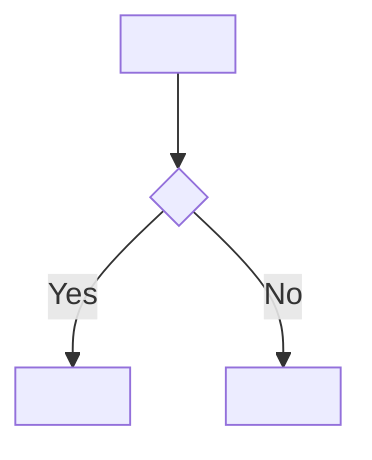

# Item System

Every piece of managed content in the V-Doc book is an **item**. Items are the atomic unit of traceability, review, and state tracking.

---

## Item Types and ID Prefixes

| Prefix | Document | V-Model Position |
|--------|----------|-----------------|
| `CuRS` | Customer Requirement Specification | Input (voice of the customer) |
| `SRS`  | Software Requirements Specification | Left side |
| `SAD`  | Software Architectural Design       | Left side |
| `SDD`  | Software Detailed Design            | Left side |
| `AT`   | Acceptance Test                     | Right side (traces SRS) |
| `SIT`  | Software Integration Test           | Right side (traces SAD) |
| `UT`   | Unit Test                           | Right side (traces SDD) |

ID format: `{PREFIX}-{NNN}` — e.g. `SRS-001`, `SDD-012`.

---

## Item File Format

Each item lives in its own file (e.g. `book/src/srs/SRS-007.md`). The filename must exactly match the item ID in uppercase. The file uses a **level-1 heading** since it is its own page in the book, with level-2 headings for each field:

```markdown
# SRS-007: User authentication via email and password

## State
`draft`

## Tags
`#auth` `#security` `#user`

## Why
Users need a secure way to identify themselves to access protected features; this is the primary authentication method chosen from CuRS-002.

## Traces
- ← [CuRS-002](../curs/CuRS-002.md): The customer explicitly requested email/password login as the primary entry point, making this a mandatory requirement
- → [SAD-003](../sad/SAD-003.md): This requirement is fulfilled by the AuthService component, which owns credential validation and session creation
- → [AT-005](../at/AT-005.md): Acceptance test verifies the full login flow from the user's perspective, including the lockout scenario

## Description

Users shall be able to authenticate using a valid email address and password.
The system shall reject invalid credentials with an appropriate error message.
The system shall lock the account after 5 consecutive failed attempts.

### Review needed
verify lockout threshold (5 attempts) and whether unlock is automatic (time-based) or manual (admin action)
```

### Review needed section rule

**Never use HTML comments or blockquotes for review points** — HTML comments are invisible in the rendered book, and blockquotes don't create navigable document sections. Always use a `### Review needed` header at the end of the item body:

```markdown
### Review needed
<specific question or assumption to verify>
```

For multiple questions on one item:

```markdown
### Review needed
- Is the lockout threshold 5 attempts or configurable per deployment?
- Should the error message distinguish "wrong password" from "user not found"?
```

**To answer inline**, the human adds a `#### Answer` subsection one level deeper:

```markdown
### Review needed
Is the lockout threshold 5 attempts or configurable per deployment?

#### Answer
5 attempts fixed — not configurable per deployment.
```

When the AI next runs, it reads the `#### Answer` content, incorporates it into the relevant field, and removes the entire `### Review needed` section. Alternatively, the human may delete the entire section to indicate approval without comment.

---

## Diagrams

Each item's `## Description` should include **at least one mermaid diagram**. A diagram makes the item self-explanatory in the rendered book and reduces ambiguity during review. Any diagram type is fine — choose whatever communicates the idea most clearly. Recommended types by layer:

| Layer | View | Recommended | What to show |
|-------|------|-------------|--------------|
| CuRS  | — | flowchart or context diagram | How the customer's process works today / the desired interaction |
| SRS   | — | sequence or flowchart | User-facing flow, including error paths and edge cases |
| SAD   | Static (`## Static View`) | `graph LR` component diagram | Module structure — which components exist and how they depend on each other |
| SAD   | Dynamic (`## Dynamic View`) | `sequenceDiagram` | Runtime message flow — how this module and its dependencies communicate during a typical operation |
| SDD   | Static (`## Static View`) | `graph LR` module call graph | Function's structural position within its parent module — sibling functions and internal call relationships |
| SDD   | Dynamic (`## Dynamic View`) | `flowchart TD` or `sequenceDiagram` | Algorithm control flow (flowchart for branching logic) or delegation sequence (sequenceDiagram for function-to-function calls) |
| SIT   | — | `sequenceDiagram` | Integration scenario — specific test sequence between components under test |
| UT    | — | flowchart or sequence | The test scenario and the expected call/return path |

> **Mermaid syntax safety**: Use `<br/>` for line breaks — not `\n` (renders literally). Quote any label containing `[`, `]`, `(`, `)`, `{`, `}`, or `:` using `["..."]` syntax — bare brackets break the parser. When in doubt, always quote: `["label"]` is always safe.


---

## Item States

| State | Meaning | Who sets it |
|-------|---------|-------------|
| `draft` | AI has written this; awaiting human review | AI |
| `reviewed` | Human has approved the content | Human |
| `done` | Implementation complete and verified | Human (after coding) |
| `deprecated` | No longer needed; kept for traceability | Human or AI (with human confirmation) |

State is declared under the `## State` heading inside the item file.

**Rule**: AI sets `draft`. Humans promote to `reviewed`, `done`, or `deprecated`. AI may propose `deprecated` but must confirm with the human before applying it.

### Deprecating an item

When a feature is removed, a requirement is superseded, or a design decision is reversed, mark the item `deprecated` rather than deleting it. Deleting breaks traceability and loses the history of why something was tried and dropped.

Add a `## Deprecated` section to the item explaining why:

```markdown
## State
`deprecated`

## Deprecated
**Reason**: <why this item is no longer needed>
**Superseded by**: [SRS-012](../srs/SRS-012.md) *(optional — link to replacement if one exists)*
**Date**: <when deprecated>
```

Cascade the deprecation: when a CuRS is deprecated, check whether its downstream SRS items are also obsolete. When an SRS is deprecated, check its AT items. Deprecate the whole chain if nothing else traces to those items. If another item still depends on a downstream item, do not deprecate it — note the partial dependency instead.

Items in `deprecated` state are excluded from review queues and build warnings. They remain in the book as a record.

---

## Tags

Tags are short lowercase labels prefixed with `#`. They appear in two places:

1. Under the `## Tags` heading in the item file: `` `#auth` `` `` `#security` ``
2. In the tag registry: `book/src/tags.md`

Tags serve two purposes:
- **Discovery**: find all items related to a concern (`#auth`, `#performance`)
- **Assignment**: when creating a new item, consult `tags.md` to reuse existing tags

### Creating a new tag

Only create a new tag if no existing tag covers the concept. Add it to `tags.md` immediately.

---

## Why Field

Every item has a `## Why` section explaining the intent behind the item — why it exists, not just what it says. This is distinct from the trace descriptions (which explain why a link exists between two items).

- **CuRS Why**: the business motivation or customer concern that prompted this input
- **SRS Why**: the software need this requirement addresses and what customer intent it formalizes
- **SAD Why**: the architectural reasoning for this component boundary or structure
- **SDD Why**: the behavioral intent this function implements within its parent component
- **AT/SIT/UT Why**: what specific behavior or risk this test validates and why this scenario was chosen

Keep it to one or two sentences.

---

## Traceability Links

Traces appear under the `## Traces` heading. Use **relative paths directly to the item file**. No anchors needed — each item is its own page.

The description after the colon must explain **why** this item is connected to the target — not just what the target is.

```markdown
## Traces
- ← [CuRS-002](../curs/CuRS-002.md): The customer's request for email login is the direct origin of this requirement; without CuRS-002 this requirement would not exist
- → [SAD-003](../sad/SAD-003.md): The AuthService component is the architectural decision that implements this requirement; it owns credential validation and session lifecycle
- ↔ [SRS-008](../srs/SRS-008.md): Both requirements share the same authentication flow; SRS-008's lockout policy is a direct consequence of this requirement existing
```

**Bad** (what, not why):
```markdown
## Traces
- ← [CuRS-002](../curs/CuRS-002.md): Customer requirement
- → [SAD-003](../sad/SAD-003.md): Auth service
```

**Good** (why the connection exists):
```markdown
## Traces
- ← [CuRS-002](../curs/CuRS-002.md): This requirement derives directly from the customer's request for email login; the 5-attempt lockout was added as a security hardening assumption not explicitly stated by the customer
- → [SAD-003](../sad/SAD-003.md): AuthService is the sole component responsible for this requirement; it validates credentials and enforces the lockout policy defined here
```

Direction convention:
- `←` upstream (where this item originates from)
- `→` downstream (what this item produces or is tested by)
- `↔` lateral (peer items in the same layer that constrain or relate to each other)

---

## SAD Item Template

```markdown
# SAD-{NNN}: <component or structure title>

## State
`draft`

## Tags
`#tag1`

## Why
<one sentence — why this component exists and what architectural problem it solves>

## Traces
- ← [SRS-{NNN}](../srs/SRS-{NNN}.md): <which requirement this component satisfies and why this component boundary was chosen>
- → [SDD-{NNN}](../sdd/SDD-{NNN}.md): TBD — SDD items created after SAD review
- → [SIT-{NNN}](../sit/SIT-{NNN}.md): <what integration scenario this test covers>

## Static View

```mermaid
graph LR
  <CallerComponent> --> SAD-{NNN}["<ComponentName><br/><file path>"]
  SAD-{NNN} --> <DependencyComponent>
```

## Dynamic View

```mermaid
sequenceDiagram
  participant <Caller>
  participant <ComponentName>
  participant <Dependency>
  <Caller>->><ComponentName>: <primary method call>
  <ComponentName>->><Dependency>: <internal call>
  <Dependency>-->><ComponentName>: <response>
  <ComponentName>-->><Caller>: <result>
```

## Location
`src/<path>/<FileName>.{ext}`

## Responsibility
<single sentence — what this component does and nothing else>

## Dependencies
<other SAD components this depends on, or "none">

## Interface
- `<methodName>(params) → ReturnType` — <one-line description>

## Debug strategy

- **Healthy trace**:
  - `<log message on component entry>`
  - `<log message for key outbound call>`
  - `<log message on component return>`
- **Key observables**: `<var1>`, `<var2>` — inputs, outputs, and internal values most useful when something goes wrong
- **Failure signatures**:
  - `<failure mode>`: <what log pattern or missing line indicates this failure>
- **Diagnostic process**: <how to isolate a bug in this component — which log lines to check first, which downstream components to rule out>
- **Debug data model** (written to `--debug-output-dir` when set):

  | File | Format | When written | Contents |
  |------|--------|-------------|---------|
  | `<filename>.<ext>` | JSON \| log \| csv | <trigger condition> | <what data fields or entries it contains> |

### Review needed
<question about component boundary, file location, interface, or dependency>
```

---

## SDD Item Template

```markdown
# SDD-{NNN}: <ClassName.methodName() or module-level function name>

## State
`draft`

## Tags
`#tag1`

## Why
<one sentence — why this function exists and what behavior it implements within its parent component>

## Traces
- ← [SAD-{NNN}](../sad/SAD-{NNN}.md): <why this function is the implementation of a specific responsibility declared in the parent SAD component>
- → [UT-{NNN}](../ut/UT-{NNN}.md): <which behavior of this function the unit test covers>

## Static View

```mermaid
graph LR
  <ParentModule>["<ClassName or Module>"] --> fn["<functionName>()"]
  fn --> dep["<dependency>()"]
```

## Dynamic View



## Signature
`<functionName>(param: Type, ...): ReturnType`

## Algorithm
1. <Step 1 — specific action, not vague>
2. <Step 2>
3. ...

## Variables
- `<varName>: <Type>` — <purpose>

## Error cases
- `<ErrorType>` — <when this is raised and what caused it>

## Side effects
<what is written/read/mutated beyond the return value, or "none">

## Debug trace

- **Happy path**:
  - `<log message confirming step 1 fired>`
  - `<log message confirming step 2 fired>`
- **Error paths**:
  - `<ErrorType>`: <log messages that appear when this error fires, and which variable values confirm it>
- **Key variables**: `<var1>`, `<var2>` — runtime values most needed when diagnosing a failure in this function
- **Debug data model** (written to `--debug-output-dir` when set):

  | File | Format | When written | Contents |
  |------|--------|-------------|---------|
  | `<filename>.<ext>` | JSON \| log \| csv | <trigger: on entry \| on error \| on return \| always> | <exact fields — specific enough that impl can write the file without guessing> |

### Review needed
<question about algorithm detail, error handling, or edge case>
```

---

## Scanning Items

```bash
# List all items of a type
ls .sophist/src/srs/
ls .sophist/src/sad/

# Read a specific item
cat .sophist/src/srs/SRS-007.md

# All draft items across all types
grep -rl "^\`draft\`" .sophist/src/

# Items with a specific tag
grep -rl "#auth" .sophist/src/

# All pending review points
grep -rl "Review needed" .sophist/src/

# Find next available ID for a type (e.g. SRS)
ls .sophist/src/srs/ | grep "^SRS-" | sort | tail -1
```
