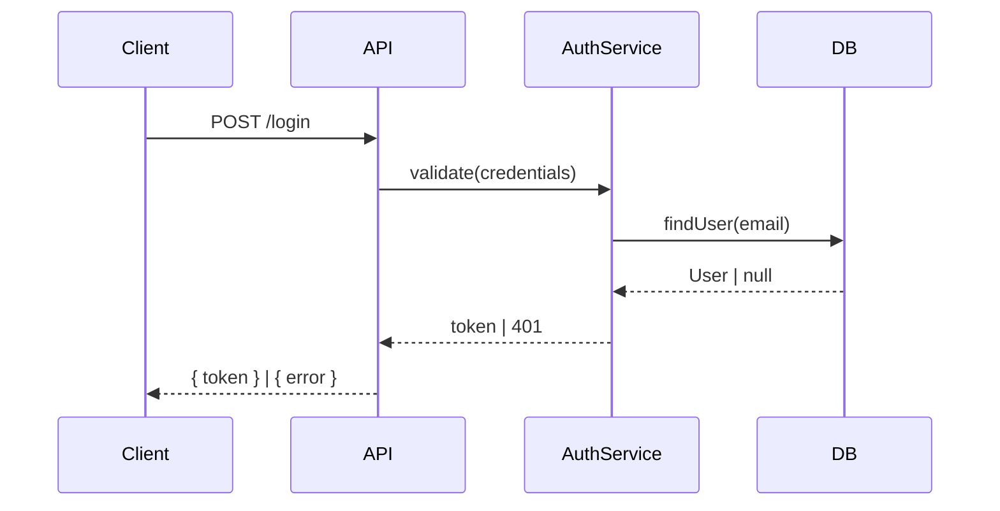

# Writing Style

## Topic-Centric Structure

Organize by **topic** (the program's own concerns), not by document type.

| Good chapter names | Bad chapter names |
|-------------------|------------------|
| `authentication.md` | `requirements/functional.md` |
| `data-sync/` | `architecture/overview.md` |
| `why-event-sourcing.md` | `design/detailed-design.md` |
| `rate-limiting.md` | `architecture/decisions.md` |

Do not create chapters called "Requirements", "Architecture", or "Detailed Design". These are meta-categories. A reader sits down to understand "how authentication works", not "the requirements".

## Narrative Flow Within Each Chapter

Each chapter flows naturally through:

1. **Context** — What does the reader need to know to understand why this topic matters?
2. **The Problem** — What goes wrong without this? What constraint forced a decision?
3. **The Solution** — What does the system do? (Requirements surface here, as answers to the problem.)
4. **The Design** — How is it structured? (Architecture and design appear here, explaining the "how".)
5. **Tradeoffs** — What did this cost? What breaks at scale? What can't we do now?

Section headers describe **content**, not phases:
- ❌ `## Requirements`
- ✅ `## Why Sessions Cannot Live in Process Memory`

- ❌ `## Architecture`  
- ✅ `## How the Token Lifecycle Works`

## Trial & Error

Failed attempts belong in the book — they prevent future readers from repeating mistakes.

```markdown
## What We Tried First

We initially stored sessions in-process using a `Map<string, Session>`.
This worked in development but caused every server restart to log out all users.

**The constraint this revealed**: sessions must outlive any single server process.

## Why Redis

Redis gives us persistence across restarts and a shared store across multiple
server instances. The tradeoff is an additional network hop per authenticated
request, which we measured at ~1ms p99 under expected load.
```

## Diagrams

Use prose to explain *why*. Use diagrams to show *what* and *how*.

Every chapter must have at least one diagram. Chapters describing flows or multi-component interactions should have more.

| Use case | Mermaid type |
|----------|-------------|
| Component relationships | `graph TD` |
| Request / event flows | `sequenceDiagram` |
| State transitions | `stateDiagram-v2` |
| Data models | `erDiagram` |
| Decision trees, tradeoffs | `graph LR` |

Example:

````markdown

````

## SUMMARY.md

Always keep SUMMARY.md in sync. mdbook fails to build if SUMMARY.md references a missing file.

Example of a topic-organized SUMMARY.md:

```markdown
# Summary

- [Introduction](./introduction.md)
- [Authentication](./authentication/README.md)
  - [Session Management](./authentication/sessions.md)
  - [Token Lifecycle](./authentication/tokens.md)
- [Rate Limiting](./rate-limiting.md)
- [Why We Chose PostgreSQL](./why-postgresql.md)
```

New pages: create the file AND add it to SUMMARY.md in logical reading order.
