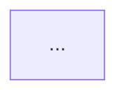

# Architectural Decision Record (ADR)

Every change — new feature, refactoring, or architecture design — is an ADR. No separate document types.

**One ADR = one problem.** If scope covers multiple independent problems, split into separate ADRs before starting. Sign of too-broad scope: grill-me branches into unrelated decision trees.

Output: `.pf/src/adr/<ID>-<slug>.md`

For layer definitions, read `references/layers.md`.
For deep module principles, read `references/deep-modules.md`.
For cross-cutting concern design, read `references/layers.md`.

## ID assignment

```bash
ls .pf/src/adr/*.md 2>/dev/null | wc -l
```

Zero-padded 4-digit format: `0001`, `0002`, etc.

---

## Step 1: Grill-me

Run `grill-me` skill to reach shared understanding before writing.

---

## Step 2: ADR template

```markdown
# [ID] Title

**Status:** Proposed | Accepted | Deprecated | Superseded by [ID]

## Context

What triggered this decision? What problem, need, or violation prompted it?
What constraints are in play?

## User Stories

A numbered list covering all aspects of the change from the user's perspective.

1. As a <actor>, I want <feature>, so that <benefit>
2. ...

Express with diagram

## Decision

What was decided and why. Walk through the three layers:

**Value** — What does end user need from this? Which features worth
building? What does success look like? What must never happen?

**Aspect** — How is need met? Which objects used and from which angle?
What algorithm or workflow produces outcome?

**Object** — What objects must exist? Each object must have more than just
data — it should own properties, actions, behaviors, and relationships relevant
to its concern. If logic that belongs to object lives outside it, object
is too thin. Are objects stable and invariant across different uses? Is
abstraction level right — not too large, not too small?

For each relationship: cardinality, ownership, navigability, aggregate boundary.
View-specific joins belong in aspect layer.

Call out any leakage between layers.

## Architecture Views

For view selection guidance, read `references/views.md`.

Identify who needs to understand this decision and draw views that answer their questions. Not every ADR needs all views — include only those that add clarity.

For each view included, label stakeholder and what question view answers:

```
**Module view** (developers) — shows how X is decomposed and where new Y lives
**C&C view** (architects) — shows runtime data flow through new pipeline
```

Use Mermaid diagrams. Each view is one focused diagram. Omit views obvious from VAO Decision or that add no new information.

## Out of Scope

What is explicitly not part of this decision.

## Before / After

Show current structure and target structure.
For greenfield decision, show only target.
In **After** diagram, mark every node that is new or changed with highlight style so delta is immediately visible:

```
classDef changed fill:#f5a623,stroke:#c97d0a,color:#000
class NewNode,ChangedNode changed
```

Use orange (`#f5a623`) as default highlight. Unchanged nodes carry no class.

**Before:**


**After:**


## Step-by-Step Plan

Each item is one RED→GREEN TDD cycle. Order from most end-to-end behavior (tracer bullet) to most specific.

For each item:
- **Behavior** — what system does (maps to User Story)
- **Test target** — which public interface to test through (value entry point, entity action)
- **File** — what to create or modify, and which layer `[value|method|entity]`

Example:

1. User can log in with valid credentials
   - Test: call `login(email, password)` → returns session token
   - Files: `src/commands/login.ts` [value], `src/services/auth.ts` [aspect]
2. User object validates its own password hash
   - Test: `user.verifyPassword(plain)` → true/false
   - Files: `src/models/user.ts` [object]
3. ...
```

After writing ADR, ask user to confirm before writing any code.

---

## After implementation is confirmed

Once user has reviewed code:

1. Use `pf-review` skill to review implementation and update documentation
2. Mark ADR status as `Accepted`

## SUMMARY.md entry

```markdown
  - [[<ID>] <title>](./adr/<ID>-<slug>.md)
```
