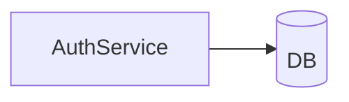
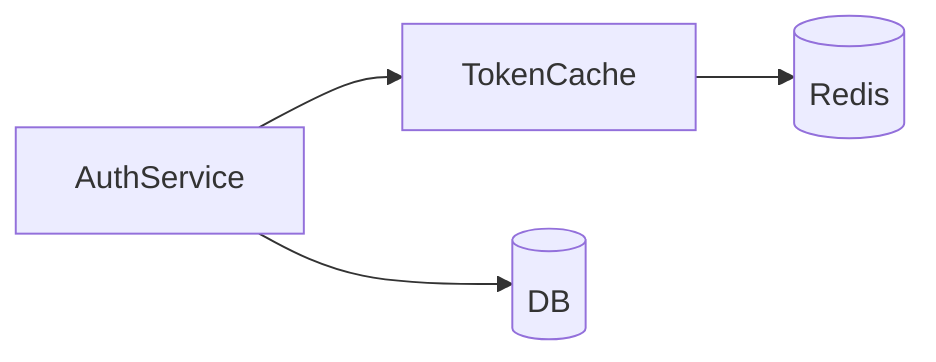

# ADR: {Title}

**Date:** {YYYY-MM-DD}

> Target: ≤20 words per sentence; total prose (excluding diagrams/tables) under ~450 words — a 5-minute read. If a draft runs over, flag it to the user and continue; don't block on it.

## Context
> What is the problem, What is the current state, What should be changed

e.g. Auth tokens are validated on every request by hitting the DB, capping throughput at 200 req/s. Move validation to a cache.

## Decision
> Concrete design — which API(s) are affected or introduced, which source file(s) hold the change, and how the source structure is organized (modules, layers, directories). A small Mermaid diagram is welcome wherever it clarifies the before/after shape faster than prose. The full Static/Dynamic View lives in the paired `architecture.md`, not here.

### Before
e.g. No cache; `AuthService.validate(token)` in `src/auth/service.py` hits the DB directly.

### After
e.g. `AuthService.validate(token)` in `src/auth/service.py` checks the new `TokenCache.get(token)` (`src/auth/cache.py`) before falling back to the DB; cache entries expire after 5 minutes.

## Observability
> Runtime checkpoints — internal state, logs, or intermediate data to observe mid-execution, with the final output.

- e.g. Log a `cache_hit`/`cache_miss` counter per request.
- e.g. The response throughput result.

## Test-Loop Design
> Check if an existing test-loop scenario already covers this; extend it rather than creating a new one. E2E only — what `run` resets/initializes, what it writes, what `verify` checks per scenario.

- e.g. Extends the existing `auth-flow` scenario. `run`: clear Redis, replay 100 recorded requests. `verify`: assert cache hit rate > 90% after warmup.

## Verification Criteria
> How a human confirms the result is good, checkable, mapped to the requirements spec's Normal / Exception / Boundary categories.

- e.g. Given a warmed cache - When 1000 req/s sustained for 60s - Then p99 latency < 20ms (Normal).
