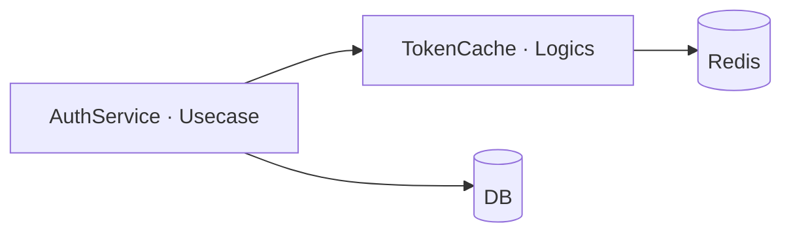

# Architecture: {Title}

**ADR:** {path to `.context/adr/{slug}.md`}

## Static View
> - Directory structure, classes — each with purpose and description — and their dependency relationships, placed per archi.md's layers (Objects/Logics/Usecase/External).
> - Dependencies as a Mermaid diagram; an arrow pointing from an inner layer to an outer one is a design error.

**Directory structure**
```
e.g.
src/auth/
  service.py   # AuthService (Usecase)
  cache.py     # TokenCache (Logics)
```

**Classes**
|Class|Layer|Purpose|
|--|--|--|
|e.g. `AuthService`|Usecase|Orchestrates token validation: cache first, DB fallback|
|e.g. `TokenCache`|Logics|Reads/writes validated tokens in Redis with a 5-minute TTL|

**Dependencies**


## Dynamic View
> - One Mermaid sequence diagram per scenario in the requirements spec's User Scenario section — name the subsection to match.

### {Scenario name}
```mermaid
e.g.
sequenceDiagram
    participant C as Client
    participant A as AuthService
    participant T as TokenCache
    participant D as DB
    C->>A: validate(token)
    A->>T: get(token)
    alt cache hit
        T-->>A: cached result
    else cache miss
        A->>D: validate(token)
        D-->>A: result
        A->>T: set(token, result)
    end
    A-->>C: result
```
