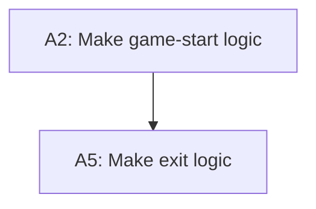

# Goal Tree: {Title}

> Nested checklist. Indentation = depth; sibling order doesn't imply an execution order — the tree only decomposes the goal, it doesn't schedule it. Siblings at each level must be MECE — mutually exclusive, collectively exhaustive (see `../references/top-down-decompose.md`). Three states: `[ ]` pending action, `[?]` pending understanding — a named unknown blocking a correct split, resolved manually and recorded inline, not researched by the skill — `[x]` done. An action line is done once its RDR and ADR are committed; an understand line is done once its answer is recorded; a non-leaf line is done once every child under it is done. A leaf is a single atomic task — one sentence under 20 words, no "and," "or," or "then" — concrete enough for a junior developer to execute without making a design decision. Detail elicited while clarifying a goal belongs in the tree as real nodes, not as a trailing comment. No depth limit — split a non-atomic node again however many levels it takes. A leaf that genuinely can't run before another one exists — even across branches — gets `(after: {path})` appended; that's the only ordering the tree records, everything else stays unordered.

- [ ] Root: {goal text}
  - [ ] A: {goal text}
    - [ ] A1: {goal text}

e.g.
- [ ] Root: Make Tetris
  - [ ] A: Make main menu
    - [x] A1: Make main menu UI → rdr: `.context/req/main-menu-ui.md`, adr: `.context/adr/main-menu-ui.md`
    - [ ] A2: Make game-start logic
    - [ ] A3: Make settings logic
    - [ ] A4: Make ranking-dashboard view logic
    - [ ] A5: Make exit logic (after: A2)
  - [ ] B: Make ranking system
    - [?] B0: Understand whether ranking needs online sync
  - [ ] C: Make game logic

## Dependencies
> Every leaf as a node, edges from prerequisite to dependent. Only real dependencies — most leaves have none and stay isolated nodes here.

