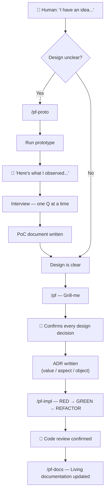
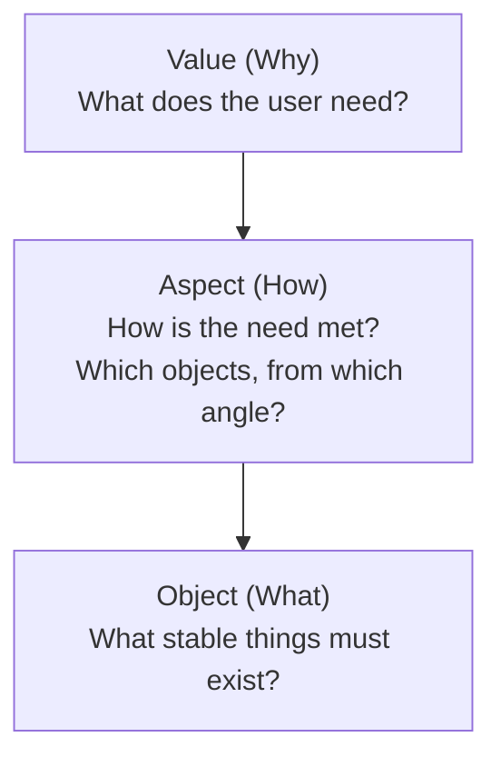
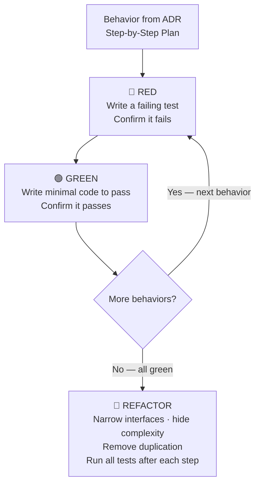
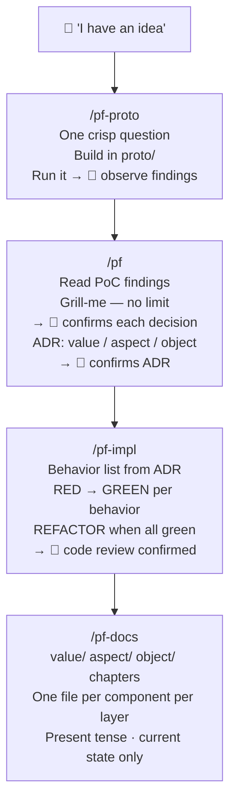

# PF Workflow
## From Idea to Living Documentation

> Prototype → Design → Implement → Document

---

# The Full Workflow



---

# Human Interaction Points

| Step | What the human does |
|------|---------------------|
| **Proto** | Runs the prototype, reports what felt surprising or wrong |
| **Grill** | Answers one design question at a time — confirms, corrects, or refines |
| **ADR** | Reads and confirms the full ADR before any code is written |
| **Impl** | Watches RED fail, GREEN pass — confirms behavior list order |
| **Review** | Reviews the final code — triggers docs on confirmation |

> The workflow never moves forward without explicit human confirmation.

---

# Why Prototype First?

A prototype is **throwaway code that answers a question.**

```
❌ "Let's design the whole system"
✅ "Can we derive invoice total from events alone — without storing it?"
```

**One PoC = one question.**

Surprising findings from running the prototype become the starting
context for architecture design — not assumptions, real observations.

---

# VAO: The Design Philosophy

Three layers. One direction.



> Design flows **Value → Aspect → Object**.
> Code labels: `[value]` `[aspect]` `[object]`

---

# The Artifacts

```
.pf/
├── src/
│   ├── adr/          # 0001-auth-flow.md — design decisions
│   ├── poc/          # 0001-cart-state.md — prototype findings
│   └── docs/
│       ├── value/    # Why — user goals per component
│       ├── aspect/   # How — workflows per component
│       └── object/   # What — domain objects per component
└── serve.sh          # mdbook server
```

---

# `/pf-proto` — Validate Before Committing

## Steps

1. **Sharpen the question** — AI drafts, human narrows until crisp & testable
2. **Build** — throwaway code in `proto/<slug>/`, one command to run
3. **Write PoC doc** — findings, architecture sketch (value/aspect/object)
4. **Interview** — one question at a time, human feedback captured verbatim
5. **Hand off** — PoC becomes starting context for `/pf`

---

# `/pf-proto` — Skill

```markdown
## Step 1: Sharpen the question (interactive)

1. Draft a question from the user's scenario — propose it out loud
2. Ask one thing to make it sharper: scope, assumption, success condition
3. Revise based on the answer — repeat until crisp and testable

A good question answers with yes/no or a clear winner:
- "Does this cart state handle concurrent modifications correctly?"
- "Can we derive invoice total from events alone, without storing it?"

One PoC = one question.

## Step 2: Build the prototype

- All prototype code lives in proto/<slug>/ at the project root
- One command to run
- No persistence, no tests, no abstractions
- Surface the full state after every action
```

---

# `/pf-proto` — PoC Document

```markdown
## Architecture

**Value** — what user goal does this serve?
**Aspect** — which workflows or decision logic connect objects to the user's goal?
**Object** — which stable objects emerged?

## User feedback

[Captured verbatim from interview — not paraphrased]

## Findings

[What the prototype revealed — surprises, confirmations, invalidated assumptions]

## Open questions

[What the prototype could not answer — becomes grill-me input]
```

---

# `/pf` — Design with Philosophy

## Steps

1. Read `references/deep-modules.md` and `references/adr.md`
2. If coming from `/pf-proto`: read the PoC document first
3. **Grill-me** — one question at a time, recommended answer provided
4. Write the ADR — value / aspect / object layers + Before/After diagrams
5. Human confirms — no code written until confirmed

---

# `/pf` — Grill-me Rules

```markdown
## Step 1: Grill-me (reach shared understanding before writing)

- Ask questions one at a time
- For each question, provide your recommended answer
- Start from highest-level perspective, narrow to details
- If a question can be answered by exploring the codebase,
  explore the codebase instead

There is no maximum number of questions.
Keep going until every branch of the decision tree is resolved.
The user can say "wrap up" to summarise and move on.
```

---

# `/pf` — ADR Structure

```markdown
# [0001] Auth Flow

**Status:** Proposed → Accepted

## Value
What does the end user need? What must never happen?

## Aspect
How is the need met? What algorithm or workflow?

## Object
What objects must exist? Properties, actions, behaviors, relationships.
(Not just data — objects must own their logic.)

## Before / After
[Mermaid diagrams — changed nodes highlighted in orange]

## Step-by-Step Plan
Each item = one RED→GREEN TDD cycle, ordered tracer-bullet first.
```

---

# `/pf-impl` — Build with Confidence

## The Loop



> Never write the next test until the current one is green.
> Never refactor while RED.

---

# `/pf-impl` — Skill

```markdown
## Step 1: Extract behaviors from the ADR

1. Behavior list — each item in Step-by-Step Plan = one RED→GREEN cycle
2. Test targets — which layers and modules get tests
3. Priority order — tracer bullet (most end-to-end) first

Example:
  1. User can log in with valid credentials     [tracer bullet]
  2. Login rejects unknown email
  3. Login rejects wrong password
  4. User object validates its own password hash

Confirm behavior list with the user before writing any code.

## Step 2: Implement — one behavior at a time

RED:   Write test through public interface → confirm it fails
GREEN: Write minimal code to pass → confirm it passes
```

---

# `/pf-docs` — Living Documentation

## What it is NOT

- Not a history of decisions — that is what ADRs are for
- Not written before code review — only after confirmation
- Not a description of what was planned — only what was actually built

## Structure: Layer-Centric

```
docs/
├── value/   01-auth.md   "Users can log in securely"
├── aspect/  01-auth.md   "Login flow validates, then issues token"
└── object/  01-auth.md   "User owns password hash + verifyPassword()"
```

Each layer covers **every component** from one angle.

---

# `/pf-docs` — Skill

```markdown
## Step 3: Write the documentation

value/<N>-<component>.md  — user need this component serves
  · Broad user goal → specific success criteria → what must never happen

aspect/<N>-<component>.md — how this component works
  · Overall workflow → decision logic → strategies and flows
  · Mermaid diagrams for flows and interactions

object/<N>-<component>.md — which objects belong to this component
  · Top-level aggregate → properties, behaviors, relationships, invariants
  · Mermaid diagrams for object relationships

Each file describes what IS, not what was decided.
Write in present tense.
```

---

# The Full Picture



---

# Getting Started

```bash
# 1. Initialize the book
/pf-init

# 2. Prototype a design question
/pf-proto  I want to check if X works before committing

# 3. Design the architecture
/pf  (or: start from PoC findings)

# 4. Implement with TDD
/pf-impl  adr-001

# 5. Write documentation
/pf-docs  adr-001

# Serve the book
.pf/serve.sh
```
